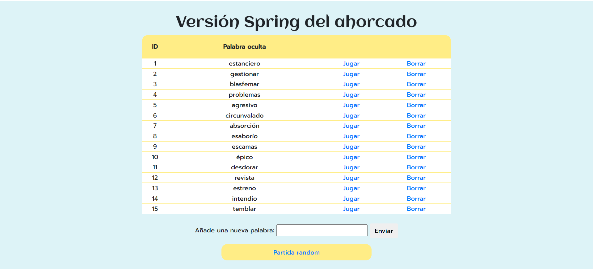

# Prueba 1. Funcionalidad simple
Para realizar este juego se han creado un controlador, un servicio y un modelo. Además, para la vista usamos una plantilla de thymeleaf.  


## Modelo
El modelo se llama Partida, y almacena todos los datos necesarios para jugar una partida. En el contructor, se les asignan los valores iniciales adecuados para que solo haga falta introducir un `id` y la palabra a adivinar. Para establecer el `estado` se crea un método (`creaEstado()`) que se encarga de sustituir cada letra de la palabra por un guión bajo. El `estado` es el atributo que nos servirá para ir guardando las letras que el usuario adivina en la posición que corresponde según la palabra, así se podrá comparar este `estado` con la palabra para ver si coincide completamente (en tal caso, habrá ganado la partida)  
```java
@Data
public class Partida {
    private long id;
    private String palabraOculta;
    private String estado;
    private String letrasFalladas;
    private String nuevaLetra;
    private int intentos;

    public long getId() {return id;}

    public String getPalabraOculta() {return palabraOculta;}

    public String getEstado() {return estado;}

    public void setEstado(String estado) {this.estado = estado;}

    public String getLetrasFalladas() {return letrasFalladas;}

    public void setLetrasFalladas(String letrasFalladas) {this.letrasFalladas = letrasFalladas;}

    public String getNuevaLetra() {return nuevaLetra;}

    public void setNuevaLetra(String nuevaLetra) {this.nuevaLetra = nuevaLetra;}

    public int getIntentos() {return intentos;}

    public void setIntentos(int intentos) {this.intentos = intentos;}

    public Partida(long id, String palabraOculta) {
        this.id = id;
        this.palabraOculta = palabraOculta;
        this.letrasFalladas = "";
        this.estado = creaEstado();
        this.intentos = 6;
    }

    private String creaEstado(){
        String estado = "";
        for (int i = 0; i < palabraOculta.length(); i++) {
            estado += "_";
        }
        return estado;
    }

}

```
## Servicio
En el servicio se almacenan todos los métodos para manejar la partida. Este servicio almacena una lista de palabras en el atributo `repositorio`. Tras crear un objeto servicio, se ejecutará el método `init()` (con la anotación `@PostConstructor`; se ejecutará tras el constructor), en el cual se crean una serie de partidas que se añaden al `repositorio`. En relación directa con este atributo se crean tres métodos; uno para añadir partidas (`add()`, aún no usado), otro para obtener todas las partidas del `repositorio` (`findAll()`) y otro que devuelve una partida según el id introducido por parámetro (`obtenerPartida()`).
```java
    private List<Partida> repositorio = new ArrayList<>();

    public void add (Partida p){
        repositorio.add(p);
    }

    public List<Partida> findAll(){
        return repositorio;
    }

    @PostConstruct 
    public void init() {
        repositorio.addAll(
                Arrays.asList(
                        new Partida (1, "pato"),
                        new Partida(2, "ornitorrinco"),
                        new Partida (3, "mamut"),
                        new Partida (4, "antílope"),
                        new Partida(5, "ñú")
                        )
        );
    }
    public Partida obtenerPartida(int id){
        return repositorio.get(id-1);
    }

```
Otro método del servicio es `compruebaLetra()`, que recibe una palabra y la letra introducida y comprueba si esa letra está en la palabra. Devuelve true si es así, y false si no la encuentra.
```java
    //comprueba si la letra es acertada o no
    public boolean compruebaLetra(String palabra, char letra){
        for (int i = 0; i < palabra.length(); i++) {
            if (Objects.equals(quitaTildes(palabra.charAt(i)), quitaTildes(letra)))
                return true;
        }
        return false;
    }
```  
También está el método `quitaTildes()`. En base a un patrón con las vocales con tildes y diéresis, se comprueba si la letra del parámetro introducido coincide con alguna de ellas; en caso de que no sea una vocal de ese patrón, se devuelve la letra (no hará falta hacerle nada), pero si coincide con una de ellas, se elimina la tilde con `Normalizer` y se devuelve el caracter sin tildes ni diéresis.  
```java
    //elimina las tildes
    public char quitaTildes(char s) {
        Pattern regex = Pattern.compile("[áéíúóäëïüöàèìòù]");
        Matcher mat = regex.matcher(s + "");
        if (!mat.matches()) 
            return s;
        String string = Normalizer.normalize(s+ "", Normalizer.Form.NFD);
        string = string.replaceAll("[\\p{InCombiningDiacriticalMarks}]", "");
        return string.charAt(0);
    }
```
El método `actualizarEstado()` recibe la palabra, el estado y la letra para recorrer la palabra y sustituir un guión por la letra recibida. En un bucle for, se recorre la palabra; si la letra en x posición sin tilde de la palabra coincide con la letra recibida por parámetro, se escribe en una variable (`nuevoEstado`), si esa letra ya está en el estado, la se escribe en la variable, y si no se cumple ninguna de estas, se escribe un guión.  
```java
    //crea un String que forma la palabra con las letras acertadas y con guiones en los caracteres no adivinados
    public String actualizarEstado(String palabra, String estado, char nuevaLetra){
        String nuevoEstado = "";
        for (int i = 0; i < palabra.length(); i++) {
            char letraActual = palabra.charAt(i);
            if (Objects.equals(quitaTildes(letraActual), nuevaLetra)) {
                nuevoEstado += letraActual;
            }else if(Objects.equals(quitaTildes(estado.charAt(i)), quitaTildes(letraActual))) {
                nuevoEstado += letraActual;
            }else {
                nuevoEstado += '_';
            }
        }
        return nuevoEstado;
    }
```
El método `asignaImg()` recibe el número de intentos de la partida y lo devuelve escrito en letras. Nos servirá para establecer la clase que deberá tener la imagen, en base a los intentos restantes. Se realiza con un switch y el valor por defecto es cero.
```java
    //asigna la clase de css que se dará a la imagen (representa los intentos)
    public String asignaImg(int intentos){
        String clase = "";
        switch (intentos){
            case 1:
                clase = "uno";
                break;
            case 2:
                clase = "dos";
                break;
            case 3:
                clase = "tres";
                break;
            case 4:
                clase = "cuatro";
                break;
            case 5:
                clase = "cinco";
                break;
            case 6:
                clase = "seis";
                break;
            default:
                clase = "cero";
        }
        return clase;
    }
```
El método `manejarPartida()` es el principal del servicio, pues recibe un objeto partida y utiliza el resto de métodos para comprobar si ha acertado la letra y realizar los cambios necesarios en la partida. Con un condicional se comprueba si la letra esté en la palabra; si es así, se actualiza el estado usando el método antes explicado. En caso de que no coincida, se comprueba si la letra ya había sido introducida; en caso de que sí y el array de falsas está vacío, se añade la letra en el array de falladas, y si no está vacío, se añade un guíon delante(para separarlas por estilo). También se resta un intento. Al final del método se vacia el atributo de nueva letra (para que no se muestre en el input de la partida) y se devuelve el objeto partida ya actualizado.
```java
    //comprobamos si ha acertado la letra usando otros métodos, y realizamos los ajustes pertinentes (número de intentos y nuevo estado)
    public Partida manejarPartida(Partida partida){
        char nuevaLetra = quitaTildes(partida.getNuevaLetra().toLowerCase().charAt(0));
        String palabra = partida.getPalabraOculta();
        if (compruebaLetra(palabra, nuevaLetra)){
            String estado = actualizarEstado(palabra, partida.getEstado(), nuevaLetra) ;
            partida.setEstado(estado);
        } else {
            String falladas = partida.getLetrasFalladas();
            if (!falladas.contains("" + nuevaLetra)){
                if (falladas.length() == 0)  partida.setLetrasFalladas(falladas + nuevaLetra);
                else  partida.setLetrasFalladas(falladas + "-" + nuevaLetra);
                partida.setIntentos(partida.getIntentos() - 1);
            }
        }
        partida.setNuevaLetra(""); 
        return partida;
    }

```


## Controlador

Con la anotación `@Autowired` se inyecta la clase `Srevicio`. El primer método es el que nos envía al índice. Se trata de una plantilla de Thymeleaf en la cual se muestra una tabla con todas las palabras del repositorio del servicio; para ello se utiliza el método `findAll()` y lo añade al modelo que se envía al index.  
El segundo método se llama con una variable en el path; el id de la partida a la que jugar. Con el id recibido se llama al método del servicio que devuleve la partida con ese id. Esa partida se añade al modelo, además de la clase de la imagen en base a los intentos de la partida (con `asignaImg()`). Finalmente se envía a la plantilla de partida con esos datos.

El último método se utiliza cuando en la plantilla de partida se envía una letra. Se comprueba que el caracter de la partida del modelo es una letra aceptada; en caso de que no, se manda un mensaje indicando que no se puede aceptar. En caso de que coincida con el patrón, se llama al método `manejarPartida()` para actualizarla como corresponde. Con estos datos y actualizando la clase imagen, se devuelve a la plantilla de partida. Antes de eso, se comprueba si ya se han acabado los intentos o el estado es igual a la palabra; si es así, se envía a la plantilla de final, donde se indicará si ganó o perdió.

```java
@Controller
public class PartidaControlador {

    @Autowired
    public PartidaService servicio;

    @GetMapping("/")
    public String index (Model model){
        model.addAttribute("listaPartidas", servicio.findAll());
        return "index";
    }

    @GetMapping("/partida/jugar/{id}")
    public String comienzaPartida (@PathVariable("id") int id, Model model){
        Partida p = servicio.obtenerPartida(id);

        String claseImagen = servicio.asignaImg(p.getIntentos());
        model.addAttribute("claseImagen", claseImagen);

        model.addAttribute( "partida", p);
        return "partida";
    }

    @PostMapping("/partida/nuevaLetra")
    public String jugada(@ModelAttribute("partida") Partida partida, Model model){
        //si el caracter introducido es una letra, procedemos a realizar la partida
        Pattern regex = Pattern.compile("[a-zA-ZÀ-ÿ\u00f1\u00d1]");
        Matcher mat = regex.matcher(partida.getNuevaLetra());
        if (mat.matches()){
            partida = servicio.manejarPartida(partida);
            model.addAttribute("noLetra", "");
        }else{
            model.addAttribute("noLetra", "Solo se aceptan letras");
            partida.setNuevaLetra("");
        }
        if (partida.getIntentos() == 0 || Objects.equals(partida.getEstado(), partida.getPalabraOculta()))
            return "final";

        String claseImagen = servicio.asignaImg(partida.getIntentos());
        model.addAttribute("claseImagen", claseImagen);
        return "partida";
    }
}

```

## Plantillas

Se han realizado tres plantillas; 
> Índice (el enlace de 'partida random' aún no es funcional)


>Partida   
Inicio de la partida; en la plantilla, se convierte los guiones del estado en tres guiones bajos para mejorar la visualización (con un `th:each`) 

Partida en curso ('Jugar otra partida' tampoco es funcional)


>Final  
Con un condicional se comprueba cómo ha terminado la partida para establecer el mensaje y la imagen. También se muestra una tabla con los datos de la partida


# Prueba 2. Partidas aleatorias
En esta prueba se añade la opción de jugar a partidas aleatorias
## Modelo
El modelo se mantiene intacto

## Servicio
Se añade un método para obtener una partida aleatoria, creando un número aleatorio en base al tamaño del array
```java
    //obtiene número aleatorio para seleccionar una partida (en base al tamaño del array de partidas)
    public int getRandom(){
        //int n = (int) (Math.random() * (<número_máximo + 1> - <número_mínimo>)) + <numero_mínimo>;
        int longitud = repositorio.size() ;
        return (int) (Math.random() * (longitud + 1 - 1) + 1);
    }
```
## Controlador
Se crea un método para obtener una partida aleatoria; al seguir los enlaces de partidas 'random', este método usará el método del servicio antes explicado para redirigir al método para iniciar una partida con el id obtenido
```java
    @GetMapping("/partida/jugar/random")
    public String partidaRandom (){
        int idPartida = servicio.getRandom();
        return "redirect:/partida/jugar/" + idPartida;
    }
```
Esta funcionalidad no se puede mostrar con una imagen

# Prueba 3. Añadir y borrar partidas
Se crean métodos para que el usuario pueda añadir y borrar partidas

## Servicio
Este método buscará el último id no usado y lo enviará. Para ello, crea una lista con todos los id y recorre todas las partidas; si el de esa posición no coincide (ha sido borrado) y se comprueba no existe más adelante (con `contains()`). Si se cumplen ambas condiciones, se devuelve ese número, si no, la última posición.
```java
    public int last(){
        List<Integer> numeros = new ArrayList<Integer>();
        for (int i = 1; i < repositorio.size()+1; i++) {
            numeros.add((int) repositorio.get(i-1).getId());
        }
        for (int i = 1; i < repositorio.size()+1; i++) {
            if (i != repositorio.get(i-1).getId() && !numeros.contains(i)){
                return i;
            }
        }
        //si todas las partidas del array son continuas, devolvemos el ultimo
        return repositorio.size()+1;
    }
```
Para añadir partidas se usará el método explicado en la primera prueba (`add()`)

## Controlador
Con este método, al clicar en el botón borrar del índice, se usa el método del servicio para borrar la partida con ese id, y se redirige al método que lleva al índice (buscará de nuevo todas las partidas para mostrar la tabla actualizada)
```java
    @GetMapping("/partida/borrar/{id}")
    public String borrarPartida(@PathVariable("id") int id){
        servicio.delete(id);
        return "redirect:/";
    }
```
Este método añade la palabra introducida por el usuario a la lista del servicio solo si coincide con el patrón permitido (solo letras), con el id indicado por el método `last()`. En caso de que no coincida, se envía un mensaje indicándolo en al modelo. Finalmente se buscan todas partidas que hay y se envía al índice.
```java 
    @PostMapping("/addPartida")
    public String anadePalabra(@RequestParam String palabra, Model model){
        //si el carcter introducido es una letra, procedemos a realizar la partida
        Pattern regex = Pattern.compile("[a-zA-ZÀ-ÿ\u00f1\u00d1]*");
        Matcher mat = regex.matcher(palabra);
        if (mat.matches() && !palabra.equals("")) {
            servicio.add(new Partida(servicio.last(), palabra));
            model.addAttribute("msg", "");
        }else{
            model.addAttribute("msg", "La palabra solo puede contener letras");
        }
        model.addAttribute("listaPartidas", servicio.findAll());
        return "index";
    }
```
## Plantilla
>Índice  


# Prueba 4. Palabras aleatorias y estilos
Añadiendo un método en el servicio, se usará una web en la que se leen los datos de una palabra aleatoria y se transforma a JSON (formato en el que se escribe) para obtener la palabra. También se añadieron colores, fuentes y estilos usando Bootstrap y CSS

## Servicio
Se leen los datos de una página que muestra una palabra aleatoriamente. Usando JSON obtenemos los datos del cuerpo, cogiendo el elemento qeu guarda la palabra (en caso de haber espacios, lo separamos y solo usamos la primera palabra). Se añade a la lista creada anteriormente. Se repite el proceso tantas veces como se indica en el pará metro recibido, y se devuelve el listado.
```java
    public List<String> generateRandomWords(int numberOfWords) throws IOException, JSONException {
        List<String> listado = new ArrayList<>(List.of(new String[0]));
        for (int i = 0; i <= numberOfWords; i++) {
            StringBuilder result = new StringBuilder();
            String nueva;
            URL url = new URL("https://palabras-aleatorias-public-api.herokuapp.com/random");
            HttpURLConnection conn = (HttpURLConnection) url.openConnection();
            conn.setRequestMethod("GET");
            try (var reader = new BufferedReader(new InputStreamReader(conn.getInputStream()))) {
                for (String line; (line = reader.readLine()) != null; ) {
                    result.append(line);
                }
            }
            JSONObject jsonarray = new JSONObject(result.toString());
            JSONObject objeto = jsonarray.getJSONObject("body");
            nueva = objeto.getString("Word"); //obtiene valor 10
            listado.add(nueva.split(" ")[0]);
        }
        return listado;
    }
```
Para usar este método se reescribe el método `init()`; se recorre el listado obtenido al invocar el método anterior y crean las partidas en base a esas palabras
```java
    @PostConstruct //se ejecuta tras ejecutar el constructor
    public void init() throws IOException, JSONException {
        List<String> palabras = generateRandomWords(14);
        for (int i = 0; i < palabras.size(); i++) {
            repositorio.add(new Partida(i+1, palabras.get(i)));
        }
    }
```

Dado que ahora los id no están ordenados, se cambia el método de `obtenerPartida()`. Para ello se busca en el `repositorio` una partida con ese id.
```java
    public Partida obtenerPartida(int id){
        int i;
        for (i = 0; i <= repositorio.size(); i++) {
            if (repositorio.get(i).getId() == id)
                break;
        }
        return repositorio.get(i);
    }
```

## Plantillas

>Índice



>Partida  
Se cambiaron los guiones bajos por unas imágenes sobre las que se escriben las letras y guiones


>Final


